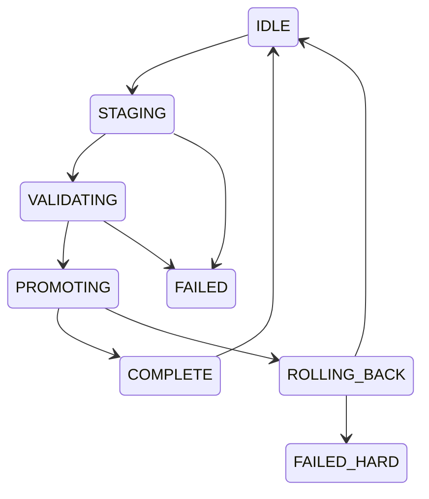

# Lifecycle State Machine

## States
IDLE → STAGING → VALIDATING → PROMOTING → COMPLETE  
ROLLING_BACK → IDLE  
FAILED → IDLE  
FAILED_HARD (terminal until manual fix)

## State Diagram (Mermaid)

## Invariants

- Only one active operation
- FAILED_HARD locks all actions
- State must persist on every transition